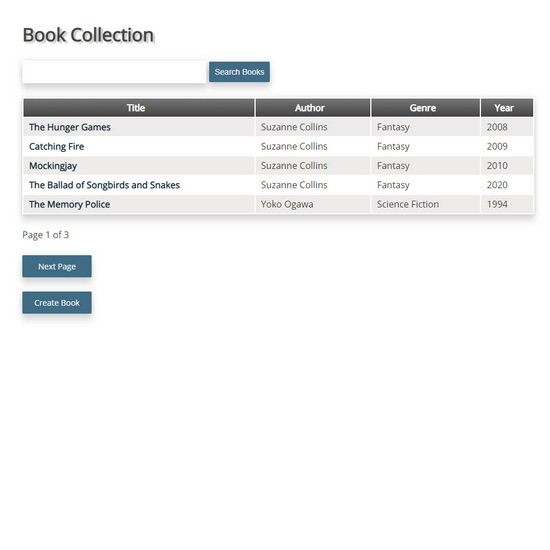

# Library Manager

An application written using NodeJS and the ExpressJS framework to track a collection of books stored in a SQLite database. 

Users are able to:

* Search the database for books.
* View details for each book.
* Add a book to the collection.
* Edit or delete each book's record.

A live demo can be found [here](https://portfolio-sql-library-manager.wn.r.appspot.com/books).

## Table of Contents

* [General Info](#general-information)
* [Technologies Used](#technologies-used)
* [Features](#features)
* [Screenshots](#screenshots)
* [Contact](#contact)

## General Information

- This was the eighth project in my Team Treehouse Full-Stack JavaScript Tech Degree.
- I received grade of "Exceeds Expectations" (the highest available).
- Queries are handled using the Sequelize ORM and views are rendered using the Pug template engine.
- The main focus in this project was on expanding knowledge of working with SQL queries. 
- There was also emphasis on validating, interacting with and displaying the data stored within the database.

## Technologies Used

- NodeJS
- ExpressJS
- Sequelize
- Pug
- CSS

## Screenshots

## Contact

Created by [@jimjitsuesq](https://www.jimpeters.dev/).  Feel free to contact me!
